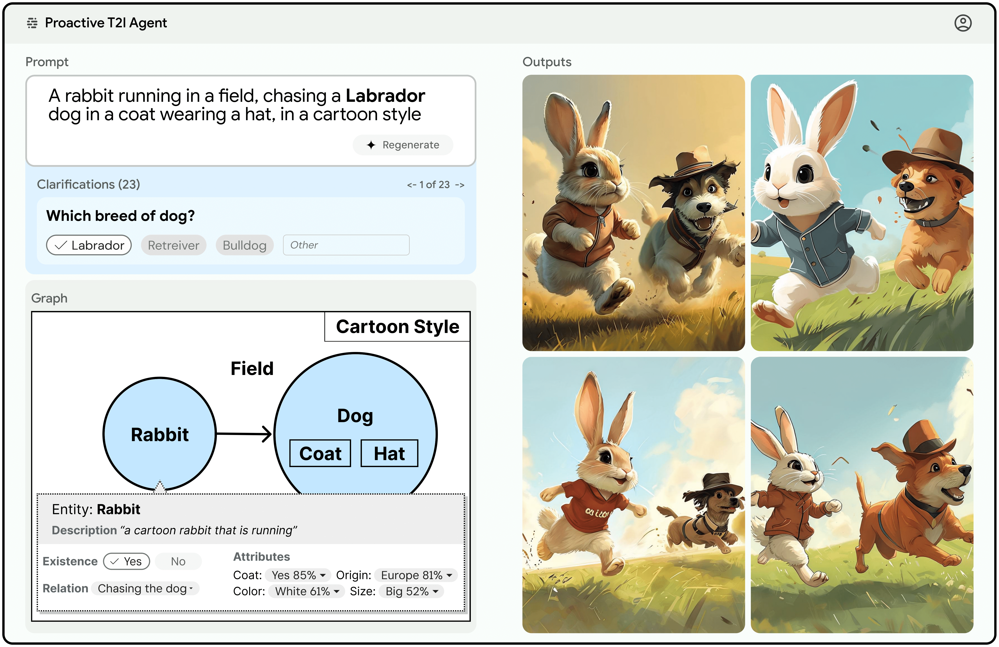

# Proactive Agents for Multi-Turn Text-to-Image Generation under Uncertainty


User prompts for generative AI models are often underspecified or open-ended,
which may lead to sub-optimal responses. This prompt underspecification problem
is particularly evident in text-to-image (T2I) generation, where users commonly
struggle to articulate their precise intent. This disconnect between the user’s vision
and the model’s interpretation often forces users to painstakingly and repeatedly
refine their prompts. To address this, we propose a design for proactive T2I agents
equipped with an interface to actively ask clarification questions when uncertain,
and present their understanding of user intent as an interpretable belief graph
that a user can edit. We build simple prototypes for such agents and verify their
effectiveness through both human studies and automated evaluation. We observed
that at least 90% of human subjects found these agents and their belief graphs
helpful for their T2I workflow. Moreover, we use a scalable automated evaluation
approach using two agents, one with a ground truth image and the other tries to
ask as few questions as possible to align with the ground truth. On DesignBench, a
benchmark we created for artists and designers, the COCO dataset (Lin et al., 2014)
and ImageInWords ([Garg et al., 2024](https://arxiv.org/abs/2405.02793)), we observed that these T2I agents were able
to ask informative questions and elicit crucial information to achieve successful
alignment with at least 2 times higher VQAScore ([Lin et al., 2024](https://arxiv.org/abs/2404.01291)) than the standard
single-turn T2I generation. 


[Demo Video](https://www.youtube.com/watch?v=HQgjLWp4Lo8) , [Paper Link](https://arxiv.org/abs/2412.06771),  [Demo notebook](https://github.com/google-deepmind/proactive_t2i_agents/blob/main/agent_demo.ipynb)



## Proactive Agent code

The ```agent/``` directory contains the implementation of the proposed agent that is powered by Gemini 1.5 Pro. The [agent_demo.ipynb](https://github.com/google-deepmind/proactive_t2i_agents/blob/main/agent_demo.ipynb) notebook can be used to play with the agent!


## DesignBench Dataset

### Data Info
The dataset includes 30 images containing different objects and scenes. 

The images have been sourced from www.unsplash.com, www.pexels.com, www.freepik.com (the licenses for the images are listed below).

Out of the 30 images: 8  contain animals, 9 images contain humans or partial human figures, 15 images contain only inanimate objects and 2 contain only a scene. The dataset contains a variable number of subjects (1-8) per image. Images are captured in different conditions, environments and under different angles.We include a file dataset/prompts_and_classes.json which contains two types of prompts per image: a lengthy detailed prompt and a short concise prompt lacking details. These are the prompts used in the paper for all experiments using DesignBench. The images have been sourced from www.unsplash.com, www.pexels.com, www.freepik.com.

### Data Access

`designbench/prompts_and_classes.json` file contains a list of all the image names, reference links to the images, and a short and long prompt per image. The images have been cropped from their original form to directly download the cropped version of the photos that was used in the paper visit `designbench/images/` 

### Licenses
**Unsplash**: 
Unsplash grants you an irrevocable, nonexclusive, worldwide copyright license to download, copy, modify, distribute, perform, and use images from Unsplash for free, including for commercial purposes, without permission from or attributing the photographer or Unsplash. This license does not include the right to compile images from Unsplash to replicate a similar or competing service.

**Pexels**: All photos and videos uploaded on Pexels are licensed under the Pexels license. This means you can use them for free for personal and commercial purposes without attribution. For more information read the following questions in this guide, or refer to our license page or our Terms of Service.

**FreePik**: Freepik and Flaticon PDF licenses allow you to use our resources without crediting the author and these will remain active even when your Premium or Premium+ subscription has expired.Please remember to download the license PDF files and keep them in a safe place. We recommend you to download them right after downloading the file.https://support.freepik.com/s/article/How-to-download-Freepik-premium-licenses?language=en_US


## Citing this work
If you find this code useful, please cite our paper
```
@misc{hahn2024proactive,
    title={Proactive Agents for Multi-Turn Text-to-Image Generation Under Uncertainty},
    author={Meera Hahn and Wenjun Zeng and Nithish Kannen and Rich Galt and Kartikeya Badola and Been Kim and Zi Wang},
    year={2024},
    eprint={2412.06771},
    archivePrefix={arXiv},
    primaryClass={cs.AI}
}

```
## License


Copyright 2024 DeepMind Technologies Limited

All software is licensed under the Apache License, Version 2.0 (Apache 2.0); you may not use this file except in compliance with the Apache 2.0 license. You may obtain a copy of the Apache 2.0 license at: https://www.apache.org/licenses/LICENSE-2.0

All other materials are licensed under the Creative Commons Attribution 4.0 International License (CC-BY). You may obtain a copy of the CC-BY license at: https://creativecommons.org/licenses/by/4.0/legalcode

Unless required by applicable law or agreed to in writing, all software and materials distributed here under the Apache 2.0 or CC-BY licenses are distributed on an "AS IS" BASIS, WITHOUT WARRANTIES OR CONDITIONS OF ANY KIND, either express or implied. See the licenses for the specific language governing permissions and limitations under those licenses.

This is not an official Google product.

## Contact

Please direct any questions to quest_for_agency@google.com

